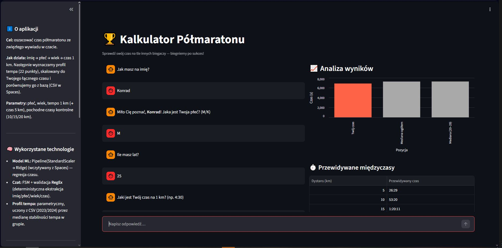
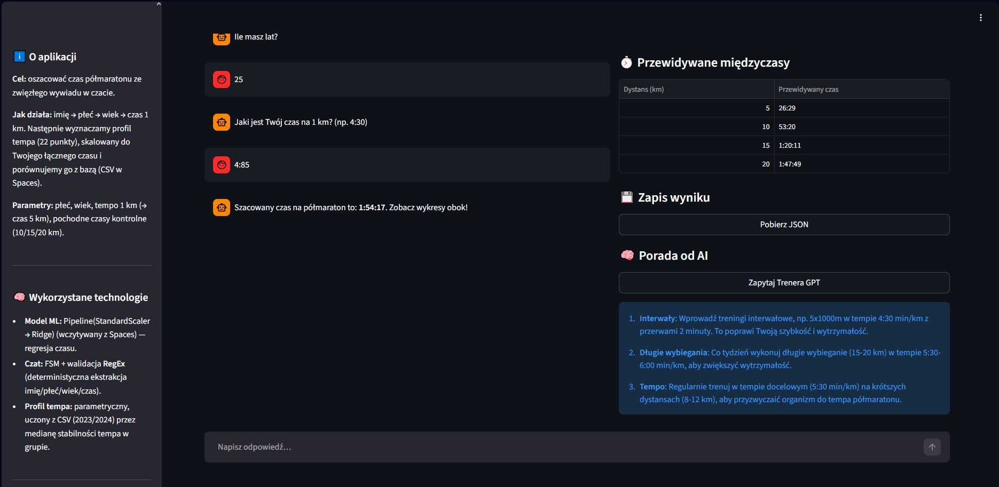
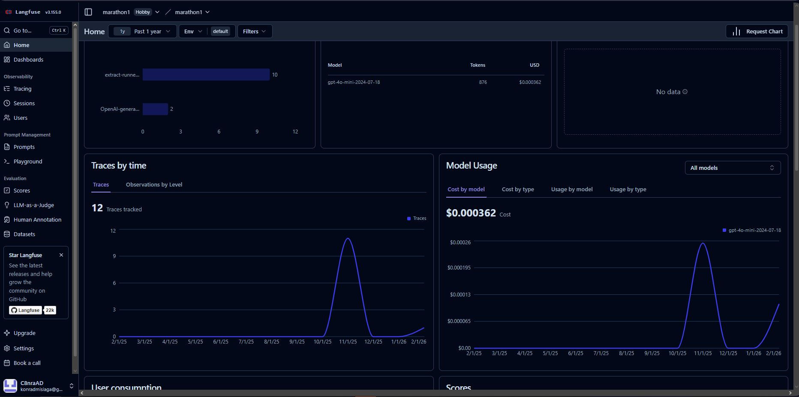

# 🏃‍♂️ AI Kalkulator Półmaratonu
<a href="https://whale-app-k2xqp.ondigitalocean.app" target="_blank"> Aplikacja</a>

##  O projekcie i wartości biznesowej
Aplikacja to interaktywny asystent biegowy, który szacuje czas ukończenia półmaratonu na podstawie krótkiego wywiadu. Wykorzystuje model uczenia maszynowego wytrenowany na historycznych wynikach tysięcy zawodników. Oprócz samej predykcji, narzędzie generuje spersonalizowany profil tempa (międzyczasy na kluczowych kilometrach) oraz oferuje porady treningowe od sztucznej inteligencji.

## 🛠 Technologie i Ekosystem
* **Frontend & Logika UI:** Streamlit (wykorzystanie maszyny stanów FSM do obsługi czatu).
* **Machine Learning:** `scikit-learn` (Ridge Regression).
* **Data Engineering & Optymalizacja:** `NumPy` (wektoryzacja obliczeń), `Pandas`.
* **Chmura & MLOps:** AWS S3 / DigitalOcean Spaces (przechowywanie modelu i danych referencyjnych).
* **Generative AI:** OpenAI (GPT-4o-mini) + Langfuse (monitorowanie i telemetria LLM).
* **Wizualizacje:** Altair.

##  Kluczowe Rozwiązania Architektoniczne

Projekt został zaprojektowany z myślą o wydajności i integracji z zewnętrznymi serwisami:

1. **Zoptymalizowany Silnik Obliczeniowy (NumPy):** Zamiast powolnych, iteracyjnych pętli w Pythonie, generowanie 22-punktowego profilu tempa (skumulowane czasy i interpolacja) zostało zaimplementowane z użyciem wektoryzowanych funkcji `np.cumsum` i `np.interp`. Znacząco redukuje to złożoność obliczeniową.
2. **Architektura Czatbota (FSM):** Interfejs użytkownika oparty jest na deterministycznej maszynie stanów (Finite State Machine). Walidatory oparte na wyrażeniach regularnych (RegEx) pilnują poprawności wprowadzanych danych krok po kroku, zanim zapytanie trafi do modelu ML.
3. **Cloud-Native:** Aplikacja ładuje model (`.pkl`) oraz dane agregacyjne (`.csv`) bezpośrednio z chmury obiektowej (S3), co uniezależnia kod od ciężkich plików i ułatwia wdrażanie na platformach PaaS.
4. **Integracja i Telemetria LLM:** Wykorzystanie wrappera `langfuse.openai` pozwala nie tylko na generowanie spersonalizowanych porad, ale zapewnia też pełne monitorowanie kosztów, opóźnień i jakości logów na dashboardzie Langfuse.

## 📸 Zrzuty Ekranu

## 🧠 Model Machine Learning
Prognoza opiera się na stabilnym potoku: `Pipeline(StandardScaler → Ridge Regression)`.

* **Dane uczące:** Połączony zbiór wyników z lat 2023-2024, obejmujący **18 377** biegaczy (po czyszczeniu danych).
* **Walidacja krzyżowa (CV=5):** * **R²:** 0.9834 (model tłumaczy ponad 98% wariancji w danych).
    * **MAE:** ~54 sekundy (błąd prognozy mniejszy niż minuta na dystansie 21 km).
* **Zastosowanie praktyczne:** Wdrożony model operuje na założeniu błędu konserwatywnego (±5 minut), aby uwzględnić "szum" wprowadzany przez subiektywne dane użytkownika podawane w czacie.

