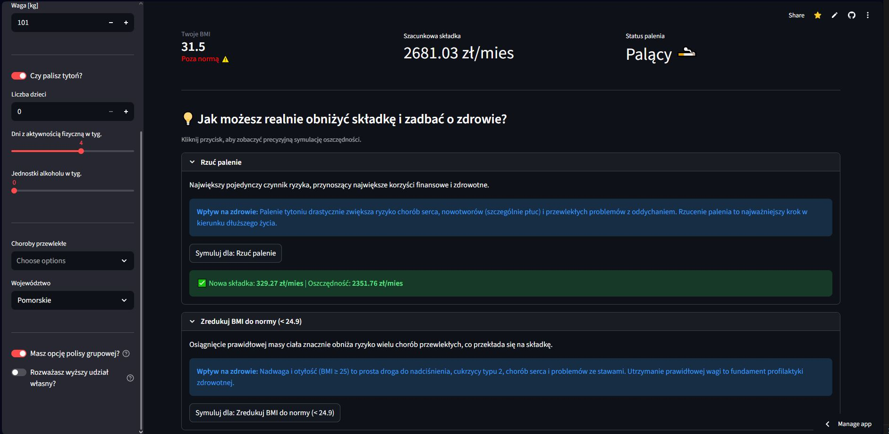
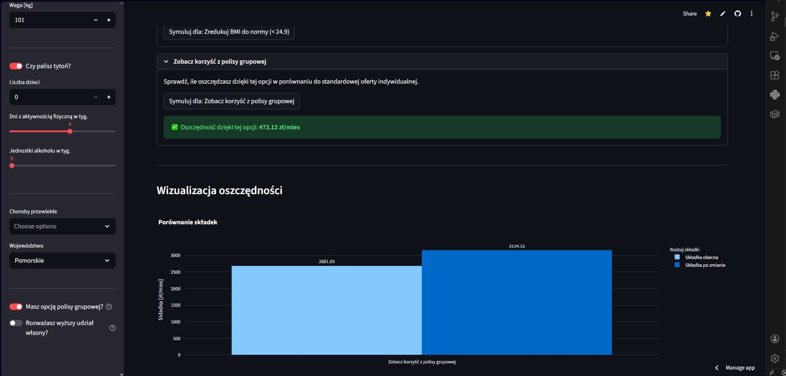

# 🩺 Optymalizator Składek Zdrowotnych (AI & Reguły Biznesowe)
<a href="https://doradcaskladki.streamlit.app" target="_blank"> Aplikacja</a>

##  O projekcie i wartości biznesowej
Aplikacja to interaktywne narzędzie InsurTech (Insurance Technology). Szacuje wysokość składki ubezpieczenia zdrowotnego na podstawie profilu ryzyka użytkownika. Największą wartością biznesową projektu jest wbudowany **Silnik Rekomendacji**, który nie tylko wytyka problemy zdrowotne, ale przeprowadza symulację finansową "w locie" – pokazując dokładnie, ile pieniędzy użytkownik zaoszczędzi, jeśli np. rzuci palenie lub zredukuje BMI.

## 🛠 Technologie i Ekosystem
* **Frontend & Wizualizacja:** Streamlit, Plotly Express (dynamiczne wykresy słupkowe oszczędności).
* **Machine Learning:** PyCaret (automatyzacja potoków ML, ładowanie modelu predykcyjnego).
* **Data Engineering:** Pandas, Python 3.9+ (typowanie statyczne).
* **Architektura:** Wzorce obiektowe, Immutable Data Structures (`@dataclass(frozen=True)`), Functional Programming (wykorzystanie `Callable`).

## Kluczowe Rozwiązania Architektoniczne

Kod zrywa z typowym dla Streamlita, płaskim paradygmatem skryptowym na rzecz dojrzałej inżynierii oprogramowania:

1. **Niezmienne Struktury Danych (Immutability):** Stan aplikacji i konfiguracja są zarządzane przez zamrożone klasy danych (`AppConfig`, `UserProfile`, `AppState`). Chroni to aplikację przed niepożądanymi efektami ubocznymi (side-effects) i gwarantuje spójność danych podczas symulacji.
2. **Dynamiczny Silnik Regułowy:** Klasa `RecommendationEngine` ewaluuje profil użytkownika za pomocą funkcji wyższego rzędu. Każda rekomendacja posiada własną logikę aktywacji (`applies_when`) oraz funkcję transformującą stan (`simulate_change`), co pozwala na łatwe skalowanie i dodawanie nowych reguł biznesowych bez modyfikacji rdzenia systemu.
3. **Separacja Warstw (SoC):** Logika prezentacji (`ui_sidebar`, `ui_dashboard`) jest całkowicie odizolowana od logiki domenowej (obliczanie składek) i zarządzania sesją.
4. **Zarządzanie Stanem Symulacji:** Zmiana jakiegokolwiek parametru użytkownika powoduje automatyczny reset aktywnych symulacji, zapobiegając błędom logicznym na wykresach oszczędności.

## 📸 Zrzuty Ekranu

## 🧠 Model Machine Learning
Rdzeniem wyceny jest model wytrenowany i spakowany przy użyciu biblioteki **PyCaret**.

* **Proces Inferencji:** Dane z obiektu `UserProfile` są mapowane do postaci wektora Pandas DataFrame.
* **Transformacja Biznesowa:** Surowa predykcja modelu (bazująca na historycznych danych w USD) jest poddawana w locie transformacjom biznesowym: przeliczeniu kursu walut (USD -> PLN), korekcie rynkowej (Market Adjustment Factor) oraz nałożeniu zniżek (polisa grupowa, wyższy udział własny).

